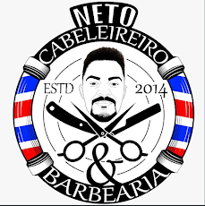

# 💈 Neto Cabeleireiro & Barbearia — Sistema de Agendamento Online

<p align="center">
  
</p>

<p align="center">
  <strong>Projeto Integrador e de Quality Assurance — Squad Bugs? Ltda.</strong><br>
  <sub>Construído com Node.js, Express, MySQL e Automatizado com Cypress E2E.</sub>
</p>

<p align="center">
  
  
  
  
</p>

---

## 🎯 Sobre o Projeto

O **Neto Cabeleireiro & Barbearia** é uma aplicação web desenvolvida para modernizar e automatizar o fluxo de marcações de clientes. O objetivo principal é extinguir o gargalo de atendimento manual no WhatsApp do estabelecimento, fornecendo uma interface intuitiva onde o próprio cliente escolhe o serviço, data e horário, gerando uma pré-confirmação instantânea integrada com a API do WhatsApp.

Este repositório foi construído com foco estrito em **Quality Assurance (QA)**, aplicando metodologias ágeis (Kanban), mapeamento rigoroso de cenários de teste (CTs) e testes automatizados de ponta a ponta (E2E).

---

## 👥 Integrantes da Squad (Bugs? Ltda.)

* **Matheus Ferreira** — Liderança & Documentação
* **Victor Souza** — Desenvolvimento do Backend & Banco de Dados
* **Gustavo Moreira** — Mapeamento de Fluxos & Execução de Testes
* **Vinicius** — Design de Casos de Teste & QA Test

---

## 🛠️ Stack Técnica

* **Front-end:** HTML5, CSS3 (Design Premium Dark & Gold), JavaScript Assíncrono (Fetch API).
* **Back-end:** Node.js com o framework Express.
* **Banco de Dados:** MySQL (Persistência de agendamentos e horários).
* **Automação de Testes:** Cypress E2E & Validations.

---

## 📂 Estrutura do Repositório

```text
├── public/                  # Front-end da aplicação
│   ├── index.html           # Interface principal de agendamento
│   └── logo.png             # Logo oficial da barbearia
├── cypress/                 # Estrutura de automação de testes
│   └── e2e/
│       ├── agendamento.cy.js # Fluxo principal de sucesso (CT-01 e CT-02)
│       └── validacoes.cy.js  # Testes de borda e cenários negativos
├── server.js                # Servidor API Node.js & Conexão MySQL
├── package.json             # Dependências e scripts do projeto
└── README.md                # Documentação oficial
